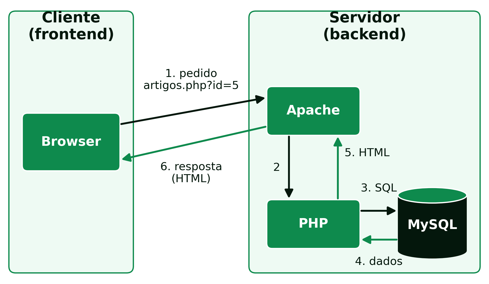

```{=html}
<div class="hero hero-chapter" style="background-image: linear-gradient(to top, rgba(4,23,12,0.88) 0%, rgba(4,23,12,0.6) 20%, rgba(4,23,12,0.15) 45%, rgba(4,23,12,0) 65%), url('../assets/images/heroes/cap02.jpg');">
  <div class="hero-badge">Capítulo 2</div>
  <h1>Arquiteturas Web e Infraestruturas</h1>
</div>
```

## Arquiteturas Web {#sec-02-arquiteturas}

### Arquitetura Cliente-Servidor {#sec-02-cliente-servidor}

O modelo cliente-servidor é o paradigma de arquitetura amplamente usado no
desenvolvimento de aplicações web, no qual os papéis dos computadores ou
dispositivos envolvidos se dividem em duas categorias:

- **Cliente**: dispositivo ou programa que faz pedidos a um servidor para
  obter serviços, recursos ou informação. É tipicamente o *browser*,
  em computadores, telemóveis ou tablets, e é responsável por interagir
  com o utilizador e enviar pedidos ao servidor.
- **Servidor**: programa que responde aos pedidos dos clientes,
  processando-os, realizando operações e enviando as respostas de volta.

Um só computador pode desempenhar os dois papéis ao mesmo tempo, correndo
tanto o cliente como o servidor, e um servidor pode responder a muitos
clientes em simultâneo. O que nunca muda é a direção do pedido: é sempre o
cliente que inicia a comunicação, o servidor limita-se a responder. Um
servidor não envia dados a um cliente por iniciativa própria, sem que
antes exista um pedido.

Este modelo tem uma consequência direta na forma como uma aplicação web se
organiza: o código que corre no cliente, HTML, CSS e JavaScript, é
enviado pelo servidor mas depois executado inteiramente no computador do
utilizador, fora do controlo do programador de *backend*; já o código que
corre no servidor, neste caso PHP, nunca é visível ao cliente, que recebe
apenas o resultado do seu processamento. Esta separação é a base de toda
a arquitetura estudada nesta UC: o *frontend* corre no cliente, o
*backend* corre no servidor, e os dois lados comunicam através do
protocolo HTTP.

Uma **página estática**, um ficheiro `.html`, é enviada ao cliente tal
como está guardada no disco. Uma **página dinâmica**, um ficheiro
`.php`, é executada pelo servidor a cada pedido, e o HTML que o cliente
recebe é gerado nesse momento a partir dos dados disponíveis
(@fig-02-pedido-dinamico). No sítio de uma revista *online*, quando um
leitor abre o endereço `artigos.php?id=5`:

1. o *browser* envia o pedido ao servidor web, através do protocolo HTTP;
2. o servidor web, o `Apache`, reconhece um ficheiro PHP e entrega-o ao
   interpretador de PHP;
3. o PHP executa o código, que pede à base de dados o artigo número 5;
4. a base de dados, o `MySQL`, devolve o título, o autor e o texto desse
   artigo;
5. o PHP insere esses dados num modelo de página e produz HTML;
6. o servidor web envia esse HTML ao *browser*, que o mostra ao leitor.

{#fig-02-pedido-dinamico}

Se o artigo for corrigido na base de dados, o pedido seguinte já mostra
a versão corrigida, sem que nenhum ficheiro HTML tenha sido editado.

### Model-View-Controller (MVC) {#sec-02-mvc}

O MVC é um padrão de arquitetura de software, proposto originalmente por
Trygve Reenskaug em 1978, durante o seu trabalho no Xerox PARC sobre a
linguagem Smalltalk [@reenskaug2003mvc]. Hoje é um dos padrões mais usados
no desenvolvimento de aplicações web, e separa a aplicação em três
componentes:

- **Model** (Modelo): representa os dados e a lógica de negócio da
  aplicação. Lida com o acesso à base de dados, o processamento de
  dados e as regras de negócio, sendo responsável por armazenar e
  recuperar informação.
- **View** (Visualização): responsável por apresentar os dados ao
  utilizador, cuidando da interface e da forma como a informação é
  mostrada. Pode ser uma página web, uma interface gráfica ou qualquer
  outro método de apresentação.
- **Controller** (Controlador): atua como intermediário entre o modelo
  e a visualização. Recebe os pedidos do utilizador, processa-os e
  decide o que fazer com base neles, atualizando o modelo conforme
  necessário e escolhendo a visualização apropriada para mostrar os
  resultados.

Numa aplicação PHP típica, o HTML e a CSS constituem a *View*, o PHP
implementa o *Controller* (e, frequentemente, também parte do
*Model*), e a base de dados, como o MySQL, é onde o *Model* persiste os
dados.

A principal vantagem do MVC é a separação de responsabilidades: quem
altera a aparência de uma página não precisa de mexer na lógica de
negócio, e quem altera a forma como os dados são processados não precisa
de mexer no HTML. Isto facilita a manutenção do código à medida que a
aplicação cresce, permite que partes diferentes da aplicação sejam
testadas de forma independente, e possibilita que várias pessoas
trabalhem em simultâneo em componentes diferentes da mesma aplicação sem
interferirem umas com as outras.

### Arquitetura em Três Camadas {#sec-02-tres-camadas}

Intimamente relacionada com o MVC está a arquitetura em três camadas
(*3-tier*), que separa uma aplicação em camada de apresentação (o que o
utilizador vê e com que interage), camada de lógica de negócio
(o processamento e as regras da aplicação) e camada de dados (o
armazenamento persistente). Numa aplicação PHP, isto traduz-se,
tipicamente, em HTML/CSS na camada de apresentação, PHP na camada de
lógica, e MySQL na camada de dados.

A diferença entre o MVC e a arquitetura em três camadas é sobretudo de
nível: o MVC é um padrão de organização do código dentro de uma
aplicação, enquanto a arquitetura em três camadas descreve, de forma mais
geral, como essas responsabilidades se distribuem, podendo inclusivamente
correr em máquinas físicas diferentes, por exemplo um servidor de
aplicação separado do servidor de base de dados. Na prática, para uma
aplicação PHP como as desenvolvidas nesta UC, as duas arquiteturas
descrevem, em grande medida, a mesma separação de responsabilidades vista
de ângulos diferentes.

### Renderização no Servidor e no Cliente {#sec-02-renderizacao}

No percurso descrito acima, é o servidor que monta a página completa:
a página é **renderizada no servidor** (*server-side rendering*), o
modelo do PHP e o seguido neste livro. Nas **aplicações de página única**
(*Single Page Applications*, SPA), feitas com `React`, `Angular` ou
`Vue`, acontece o inverso: o servidor envia uma página quase vazia e o
código JavaScript, a correr no *browser*, pede os dados em formato JSON
e constrói a página no próprio cliente (*client-side rendering*). A
navegação fica mais fluida, mas o primeiro carregamento é mais pesado.
Muitas aplicações combinam os dois modelos.

## Infraestruturas {#sec-02-infraestruturas}

### Servidores {#sec-02-servidores}

Um servidor web é o programa responsável por escutar pedidos HTTP numa
porta de rede e devolver respostas, tipicamente páginas web ou dados. É
uma peça de *software* que corre continuamente numa máquina, à espera de
novas ligações, capaz de lidar com muitos pedidos em simultâneo, vindos
de clientes diferentes. Os servidores web mais usados incluem o `Apache`
e o `NGinX`, ambos capazes de servir páginas PHP, seja através de um
módulo embutido ou de um processo separado (como o `PHP-FPM`) que o
servidor web invoca para executar o código PHP.

Para além dos servidores web, existem outros tipos de servidores
especializados. No mundo Java, por exemplo, há servidores de aplicações
como o `GlassFish`, mantido atualmente pela Eclipse Foundation no âmbito
do Jakarta EE, e o `WildFly` (anteriormente conhecido como JBoss
Application Server; hoje o nome do produto comercial suportado pela Red
Hat é JBoss EAP). Do lado dos dados, o `MySQL Server` é o exemplo mais
comum no contexto desta UC, correndo como um processo à parte do servidor
web, e comunicando com o PHP através de uma ligação de rede local.

Em produção, estes servidores correm numa máquina sempre ligada à
Internet, normalmente de uma de três formas:

- **alojamento partilhado**: muitos sítios no mesmo servidor, já
  configurado com `Apache`, `PHP` e `MySQL`; é barato, mas dá pouco
  controlo sobre a configuração;
- **servidor virtual privado** (*Virtual Private Server*, VPS): uma
  máquina virtual alugada, que o programador configura à sua medida;
- **nuvem**, como a `Amazon Web Services`, o `Microsoft Azure` ou a
  `Google Cloud`: infraestrutura ou plataformas prontas a usar, pagas em
  função dos recursos consumidos.

### Serviços Web (API) {#sec-02-servicos-web}

Uma API (*Application Programming Interface*) de um serviço web permite
que diferentes sistemas comuniquem entre si através da rede, tipicamente
sobre HTTP. Do ponto de vista da arquitetura MVC, uma API é, em muitos
casos, um *Controller* que devolve dados estruturados, em vez de uma
página HTML pronta a mostrar ao utilizador, para serem consumidos por
outra aplicação. Os dois estilos mais conhecidos são:

- **REST** (*Representational State Transfer*): usa os métodos HTTP
  (GET, POST, PUT, DELETE) sobre recursos identificados por URLs, e
  troca dados normalmente em JSON. É hoje o estilo dominante,
  representando cerca de 75% da adoção entre programadores
  [@dreamfactory_soap_rest_2025].
- **SOAP** (*Simple Object Access Protocol*): um protocolo mais rígido
  e formal, baseado em XML, com um contrato de serviço explícito. Está
  hoje limitado sobretudo a sistemas legados em indústrias reguladas,
  como a banca, a saúde ou sistemas empresariais (ERP), onde continua a
  processar volumes de transações elevados apesar de já não ser a
  escolha para novos serviços [@dreamfactory_soap_rest_2025].

### Virtualização {#sec-02-virtualizacao}

Para desenvolver e testar aplicações web de forma isolada do sistema
operativo do computador local, e sem o risco de o resultado do trabalho
depender de particularidades desse computador, usam-se ambientes
virtualizados. Há duas abordagens principais:

**Máquinas virtuais**: cada máquina virtual inclui o seu próprio sistema
operativo completo, para além da aplicação e das suas dependências. A
vantagem é isolarem-se completamente umas das outras, e as suas
configurações poderem ser partilhadas e reproduzidas com confiança,
garantindo que todos os alunos de uma turma trabalham exatamente sobre a
mesma configuração de servidor; a desvantagem é a duplicação de recursos,
já que cada máquina virtual carrega o seu próprio sistema operativo, e
tempos de arranque mais longos.

**Contentores**: em vez de replicarem todo o sistema operativo, os
contentores partilham o núcleo do sistema operativo do anfitrião,
encapsulando apenas a aplicação e as suas dependências. O `Docker` é a
ferramenta de referência para este modelo. As vantagens são o menor
impacto no sistema, o arranque mais rápido e a facilidade de partilha,
compilação e distribuição; a desvantagem é um isolamento menos completo
do que uma máquina virtual inteira, já que todos os contentores de uma
máquina partilham o mesmo núcleo do sistema operativo.

A tabela seguinte resume as diferenças entre as duas abordagens
(@tbl-02-vm-contentor).

|                          | Máquina virtual                   | Contentor                          |
|--------------------------|-----------------------------------|------------------------------------|
| Sistema operativo        | completo, próprio de cada máquina | partilha o núcleo do anfitrião     |
| Tamanho típico           | vários *gigabytes*                | de *megabytes* a centenas de *megabytes* |
| Arranque                 | de dezenas de segundos a minutos  | segundos                           |
| Isolamento               | total                             | parcial (núcleo partilhado)        |
| Ferramenta de referência | `VirtualBox`                      | `Docker`                           |

: Comparação entre máquinas virtuais e contentores. {#tbl-02-vm-contentor}

No `Docker`, três conceitos são essenciais:

- **imagem**: o modelo com tudo o que a aplicação precisa para correr;
- **contentor**: uma imagem em execução; da mesma imagem podem
  arrancar-se vários contentores iguais, como da mesma receita se fazem
  vários bolos;
- **Docker Compose**: um ficheiro que descreve vários contentores que
  trabalham em conjunto, por exemplo o servidor web e a base de dados,
  arrancados com um só comando.

Esta distinção não é apenas académica: as mesmas duas abordagens usadas
para desenvolver localmente, numa máquina virtual ou num contentor, são
também as mais comuns para pôr uma aplicação web em produção num
servidor real, o que faz da escolha do ambiente de desenvolvimento uma
decisão com impacto direto na forma como a aplicação será depois
publicada.

### O Ambiente de Trabalho desta UC {#sec-02-ambiente-uc}

Nesta UC, o *backend* é desenvolvido dentro de contentor *docker*
com Ubuntu, contendo o servidor `Apache` (servidor web),  `MySQL` (a base de dados) e `PHP 8` (linguagem de programação).
O editor de texto usado pode ser qualquer um, como o `Visual Studio Code`.

Este ambiente isola a área de desenvolvimento do sistema operativo do computador de cada
aluno, seja `macOS`, `Ubuntu` ou `Windows`, garantindo que todos
trabalham sobre a mesma configuração de servidor, base de dados e
linguagem, independentemente do computador usado em casa.

## Referências {#sec-02-referencias .unnumbered}

::: {#refs}
:::
