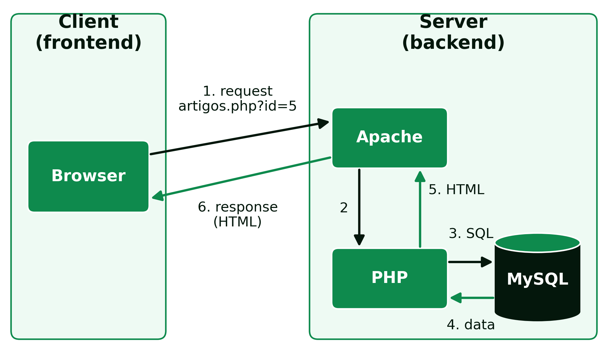

```{=html}
<div class="hero hero-chapter" style="background-image: linear-gradient(to top, rgba(4,23,12,0.88) 0%, rgba(4,23,12,0.6) 20%, rgba(4,23,12,0.15) 45%, rgba(4,23,12,0) 65%), url('../assets/images/heroes/cap02.jpg');">
  <div class="hero-badge">Chapter 2</div>
  <h1>Web Architectures and Infrastructure</h1>
</div>
```

## Web Architectures {#sec-02-architectures-en}

### Client-Server Architecture {#sec-02-client-server-en}

The client-server model is the architecture paradigm widely used in web application development, in which the roles of the computers or devices involved are split into two categories:

- **Client**: a device or program that makes requests to a server to obtain services, resources or information. It is typically the *browser*, on computers, phones or tablets, and is responsible for interacting with the user and sending requests to the server.
- **Server**: a program that responds to client requests, processing them, carrying out operations and sending the responses back.

A single computer can play both roles at the same time, running both the client and the server, and a server can respond to many clients simultaneously. What never changes is the direction of the request: it is always the client that starts the communication, the server only responds. A server does not send data to a client on its own initiative, without a prior request.

This model has a direct consequence on how a web application is organised: the code that runs on the client, HTML, CSS and JavaScript, is sent by the server but then executed entirely on the user's computer, outside the *backend* programmer's control; the code that runs on the server, in this case PHP, is on the other hand never visible to the client, which only receives the result of its processing. This separation is the basis of the whole architecture studied in this course: the *frontend* runs on the client, the *backend* runs on the server, and the two sides communicate through the HTTP protocol.

There are two types of pages on the *web*: static and dynamic. A **static page** is an `.html` file, which is sent to the client exactly as it is stored on the server's disk. A **dynamic page** is a `.php` file, executed by the server on every request, and the HTML the client receives is generated at that moment from the available data (@fig-02-dynamic-request-en).

For example, on an *online* magazine's *site*, when a reader opens the address `artigos.php?id=5`:

1. the *browser* sends the request to the web server, through the HTTP protocol;
2. the web server (for example `Apache`) recognises a PHP file and hands it to the **PHP interpreter**;
3. PHP runs the PHP code, which asks the database for article number 5;
4. the database (for example `MySQL`) returns that article's title, author and text to PHP;
5. PHP inserts that data into a page template and produces HTML;
6. finally, the web server sends that HTML to the *browser*, which shows it to the reader.

{#fig-02-dynamic-request-en}

If the article is corrected in the database, the next request already shows the corrected version without the `artigos.php` file having to be edited: the code stays the same, and it is the HTML generated on each request that now includes the updated data.

### Model-View-Controller (MVC) {#sec-02-mvc-en}

MVC is a software architecture pattern, originally proposed by Trygve Reenskaug in 1978, during his work at Xerox PARC on the Smalltalk language [@reenskaug2003mvc]. Today it is one of the most used patterns in web application development, and separates the application into three components:

- **Model**: represents the application's data and business logic. Handles database access, data processing and business rules, and is responsible for storing and retrieving information.
- **View**: responsible for presenting data to the user, taking care of the interface and how information is displayed. It can be a web page, a graphical interface, or any other presentation method.
- **Controller**: acts as the intermediary between the model and the view. Receives user requests, processes them and decides what to do based on them, updating the model as needed and choosing the appropriate view to show the results.

In a typical PHP application, HTML and CSS make up the *View*, PHP implements the *Controller* (and, often, part of the *Model* too), and the database, such as MySQL, is where the *Model* persists the data.

The main advantage of MVC is the separation of responsibilities: whoever changes a page's appearance does not need to touch the business logic, and whoever changes how data is processed does not need to touch the HTML. This makes the code easier to maintain as the application grows, allows different parts of the application to be tested independently, and makes it possible for several people to work simultaneously on different components of the same application without interfering with one another.

### Three-Tier Architecture {#sec-02-three-tier-en}

Closely related to MVC is three-tier architecture (*3-tier*), which separates an application into a presentation tier (what the user sees and interacts with), a business logic tier (the application's processing and rules) and a data tier (persistent storage). In a PHP application, this typically translates into HTML/CSS at the presentation tier, PHP at the logic tier, and MySQL at the data tier.

The difference between MVC and three-tier architecture is mainly one of level: MVC is a pattern for organising code within an application, while three-tier architecture describes, more generally, how those responsibilities are distributed, and can even run on different physical machines, for example an application server separate from the database server. In practice, for a PHP application like the ones developed in this course, the two architectures describe, to a large extent, the same separation of responsibilities seen from different angles.

### Server-Side and Client-Side Rendering {#sec-02-rendering-en}

In the path described above, it is the server that assembles the complete page: the page is **rendered on the server** (*server-side rendering*), the PHP model and the one followed in this book. In **Single Page Applications** (SPA), built with `React`, `Angular` or `Vue`, the opposite happens: the server sends an almost empty page and the JavaScript code, running in the *browser*, requests the data in JSON format and builds the page on the client itself (*client-side rendering*). Navigation becomes smoother, but the first load is heavier. Many applications combine the two models.

## Infrastructure {#sec-02-infrastructure-en}

### Servers {#sec-02-servers-en}

A web server is the program responsible for listening for HTTP requests on a network port and returning responses, typically web pages or data. It is a piece of *software* that runs continuously on a machine, waiting for new connections, capable of handling many simultaneous requests from different clients. The most used web servers include `Apache` and `NGinX`, both capable of serving PHP pages, either through a built-in module or a separate process (such as `PHP-FPM`) that the web server invokes to run the PHP code.

Besides web servers, there are other specialised types of servers. In the Java world, for example, there are application servers such as `GlassFish`, currently maintained by the Eclipse Foundation as part of Jakarta EE, and `WildFly` (formerly known as JBoss Application Server; today the name of the commercial product supported by Red Hat is JBoss EAP). On the data side, `MySQL Server` is the most common example in the context of this course, running as a process separate from the web server, and communicating with PHP through a local network connection.

In production, these servers run on a machine permanently connected to the Internet, usually in one of three ways:

- **shared hosting**: many sites on the same server, already configured with `Apache`, `PHP` and `MySQL`; it is cheap, but gives little control over the configuration;
- **virtual private server** (VPS): a rented virtual machine, which the programmer configures to suit their needs;
- **cloud**, such as `Amazon Web Services`, `Microsoft Azure` or `Google Cloud`: infrastructure or ready-to-use platforms, paid for according to the resources consumed.

### Web Services (API) {#sec-02-web-services-en}

An API (*Application Programming Interface*) of a web service allows different systems to communicate with one another over the network, typically over HTTP. From the point of view of MVC architecture, an API is, in many cases, a *Controller* that returns structured data, instead of an HTML page ready to show to the user, to be consumed by another application. The two best-known styles are:

- **REST** (*Representational State Transfer*): uses HTTP methods (GET, POST, PUT, DELETE) on resources identified by URLs, and exchanges data typically in JSON. It is today the dominant style, representing around 75% of adoption among developers [@dreamfactory_soap_rest_2025].
- **SOAP** (*Simple Object Access Protocol*): a stricter, more formal protocol, based on XML, with an explicit service contract. Today it is mostly limited to legacy systems in regulated industries, such as banking, healthcare or enterprise systems (ERP), where it continues to process high transaction volumes despite no longer being the choice for new services [@dreamfactory_soap_rest_2025].

### Virtualisation {#sec-02-virtualisation-en}

To develop and test web applications in isolation from the local computer's operating system, and without the risk of the work's outcome depending on that computer's particularities, virtualised environments are used. There are two main approaches:

**Virtual machines**: each virtual machine includes its own complete operating system, in addition to the application and its dependencies. The advantage is that they are completely isolated from one another, and their configurations can be shared and reproduced reliably, ensuring that every student in a class works on exactly the same server configuration; the disadvantage is duplicated resources, since each virtual machine loads its own operating system, and longer startup times.

**Containers**: instead of replicating the whole operating system, containers share the host operating system's kernel, encapsulating only the application and its dependencies. `Docker` is the reference tool for this model. The advantages are a smaller system footprint, faster startup, and ease of sharing, building and distribution; the disadvantage is less complete isolation than a whole virtual machine, since all the containers on a machine share the same operating system kernel.

The following table summarises the differences between the two approaches (@tbl-02-vm-container-en).

|                    | Virtual machine                     | Container                          |
|--------------------|-------------------------------------|------------------------------------|
| Operating system   | complete, specific to each machine  | shares the host's kernel           |
| Typical size       | several *gigabytes*                 | from *megabytes* to hundreds of *megabytes* |
| Startup            | from tens of seconds to minutes     | seconds                            |
| Isolation          | full                                | partial (shared kernel)            |
| Reference tool     | `VirtualBox`                        | `Docker`                           |

: Comparison between virtual machines and containers. {#tbl-02-vm-container-en}

In `Docker`, three concepts are essential:

- **image**: the template with everything the application needs to run;
- **container**: an image in execution; several identical containers can be started from the same image, just as several cakes can be made from the same recipe;
- **Docker Compose**: a file describing several containers that work together, for example the web server and the database, started with a single command.

This distinction is not merely academic: the same two approaches used to develop locally, in a virtual machine or in a container, are also the most common ways to put a web application into production on a real server, which makes the choice of development environment a decision with a direct impact on how the application will later be published.

### This Course's Working Environment {#sec-02-course-environment-en}

In this course, the *backend* is developed inside a *docker* container with Ubuntu, containing the `Apache` server (web server), `MySQL` (the database) and `PHP 8` (programming language). Any text editor can be used, such as `Visual Studio Code`.

This environment isolates the development area from each student's own computer operating system, be it `macOS`, `Ubuntu` or `Windows`, ensuring that everyone works on the same server, database and language configuration, regardless of the computer used at home.

## References {#sec-02-references-en .unnumbered}

::: {#refs}
:::
