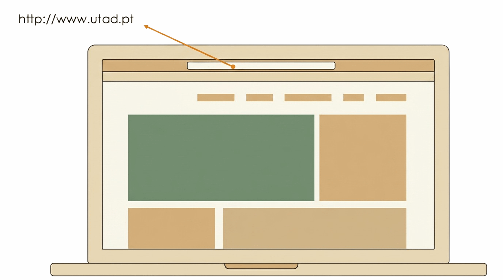

```{=html}
<div class="hero hero-chapter" style="background-image: linear-gradient(to top, rgba(4,23,12,0.88) 0%, rgba(4,23,12,0.6) 20%, rgba(4,23,12,0.15) 45%, rgba(4,23,12,0) 65%), url('../assets/images/heroes/cap06.jpg');">
  <div class="hero-badge">Chapter 6</div>
  <h1>Communication Models and Networks</h1>
</div>
```

## Why Organise Communication into Layers? {#sec-06-why-layers-en}

Before a Contraponto reader can even see the magazine's home page, the request the *browser* sends to the server only gets there after a series of operations:

- finding the address of the magazine's server;
- determining the path the data must travel to get there;
- establishing a reliable connection;
- converting the data into electrical signals or radio pulses.

This set of operations is governed by rules that regulate each of these operations — the format of messages, the order of exchanges, error handling — which is precisely what is called a communication protocol. Without it, two devices cannot understand each other.

The *browser* does all of this without Tiago, on the server side, needing to think about any of these details. Before a request can leave the *browser* and reach a server, there is an entire stack of protocols that has to work correctly underneath that communication.

What, exactly, is a **protocol**? And what is a protocol stack? A **protocol** is a set of rules agreed between two parties (two devices) that want to communicate: it defines the exact format of the messages exchanged and the order in which they must be sent, so that both sides understand each other unambiguously. A protocol can be thought of as a contract between two remote devices on a network, defining the rules for how they will communicate at a distance.

No protocol, on its own, solves every problem involved in getting a message from one computer to another: several are needed, each handling a different part of the problem, the same four operations already mentioned above.

That set of protocols is organised so that each one, when it needs a feature offered by another, turns to that other protocol to obtain it. That relationship defines a hierarchy in which the protocols that use others are "above" and the ones being used are "below". This arrangement is called a **protocol stack**, or layered architecture.

It is this stack, not a single isolated protocol, that the Contraponto reader's request has to cross, without the user noticing, before it even reaches the server.

In a layered architecture, each layer is a module that depends on the layers below it, but is completely independent of the layers above it: it only needs to know how to use the layer immediately below it, not how the layers above it work. This allows each one to be developed, optimised or replaced independently of the others, as long as the service it provides to the layers above it stays the same. That service a layer provides to the layer immediately above it, without the latter needing to know how it is implemented underneath, is precisely called a **service**.

A **service**, like a protocol, can also be thought of as a kind of contract, but with an essential difference: a protocol is a contract between two remote devices, defining how they communicate at a distance; a service is a contract between layers within the same device, defining how they work with each other, locally. In other words, a service acts locally, while a protocol acts remotely.

{#fig-06-protocol-service-en width="70%"}

## The Two Models: OSI and TCP/IP {#sec-06-osi-tcpip-en}

Historically, two reference models emerged for organising communication into layers, with different origins:

- **OSI** (*Open Systems Interconnection*): developed by ISO (*International Organization for Standardization*) as a formal model, with seven layers: physical, data link, network, transport, session, presentation and application. Because it was formally defined and approved by an international standardisation body before being widely implemented, OSI is known as the *de jure* standard (by law, i.e., formally instituted).
- **TCP/IP** (also called the DoD model, as it originated in the US Department of Defense): a simpler model, with only four layers, application, transport, network (or internet) and network access, which arose directly from the practical implementation of ARPANET, the precursor to the Internet. Because it became the model actually used, through its widespread adoption, before any formal international standardisation, TCP/IP is known as the *de facto* standard (as a matter of fact, i.e., imposed by practice and common use).

{#fig-06-osi-model-en width="45%"}

In practice, today's Internet runs on the TCP/IP model, not on OSI: OSI continues to be used, mainly, as a pedagogical tool, because it divides more finely responsibilities that, in TCP/IP, appear concentrated in a single layer. For the purposes of this course, three layers of the TCP/IP model are of particular interest:

- **Application**: where the protocols an application uses directly run, such as HTTP, the rough equivalent of OSI's three upper layers (application, presentation and session);
- **Transport**: responsible for reliably delivering data between two programs, through the `TCP` protocol;
- **Network**: responsible for routing data between different networks, to its destination, through the `IP` protocol.

Each of these layers communicates with its peer layer (on the remote device) through a **protocol** (as seen in @fig-06-protocol-service-en): a set of rules that defines how data is exchanged between two entities of the same layer, one on the client side and one on the server side. It is the Application layer protocol of the TCP/IP model, known as `HTTP`, that defines the rules for how a *browser* requests a page from a server. `HTTP` will be the topic of the next chapter.

::: {.callout-note}
To see which other real protocols run at each layer, and the more precise formalism behind the distinction between service and protocol, see @sec-apD-protocols-layer-en and @sec-apD-services-protocols-en.
:::

## The Data's Journey: Encapsulation {#sec-06-encapsulation-en}

When an application sends data, it passes through each layer of the TCP/IP model, and each layer adds its own control information, in a process called encapsulation. It is worth following this journey step by step, from the upper layers down to the physical medium.

The following figure summarises the whole journey: the data of an `HTTP` message leaves the application layer, passes through a *socket* (the connection point between the application layer and the protocol stack), and goes down the transport, network and link layers, each applying its own protocol and encapsulating the data it receives from the layer above, until it reaches the network card (`NIC`, *Network Interface Controller*), which finally converts it into an electrical or radio signal:

{#fig-06-nic-transmission-en width="55%"}

::: {.callout-note}
Do not confuse the **application layer** with the **application** itself: the application layer is just one of the layers of the TCP/IP model, defining how data is exchanged between two remote applications; the application is the program the user directly uses, such as a *browser* or an *email client*, which uses the application layer to send and receive data. In @fig-06-nic-transmission-en the *browser* or *email client* is represented by the **DADOS** rectangle, which is the application sending the data.
:::

### The Transport Layer: TCP {#sec-06-tcp-en}

The *payload* (the technical name given to the data, in this case, for example, an HTTP message) is passed to the transport layer by the application layer, through a *socket*, which adds to it a `TCP` header with the **source and destination ports**. These are two addresses that identify the **applications** sending and receiving the data — a *browser* or an *email client*.

Ports range from 0 to 65535, and the so-called *well-known ports*, from 0 to 1023, are reserved for well-known services, such as port 80 for HTTP or 443 for HTTPS. @tbl-06-common-ports-en shows the most common ports for some well-known protocols.

| Port | Protocol | Service |
|------|----------|---------|
| 80   | HTTP     | Web pages (unencrypted) |
| 443  | HTTPS    | Web pages (TLS-encrypted) |
| 21   | FTP      | File transfer |
| 25   | SMTP     | Sending email |
| 53   | DNS      | Domain name resolution |

: *Well-known* ports for some common protocols. {#tbl-06-common-ports-en}

TCP also guarantees that data arrives reliably and in the correct order: it divides it into numbered segments, and resends any segment that is not acknowledged by the receiver within a well-defined time window.

::: {.callout-note}
The exact structure of the TCP header, and the mechanisms that guarantee this reliability, are covered in more depth in @sec-apD-tcp-en, for the more curious students.
:::

### The Network Layer: IP {#sec-06-ip-en}

Next, the data passes to the network layer, to which an `IP` header is added with the **source and destination IP addresses**. An `IPv4` address has the form `(0-255).(0-255).(0-255).(0-255)`, such as `192.168.24.36`; this address identifies each computer even if they are on different networks.

The same computer can have several IP addresses, one for each network interface it has. This is the case in @fig-06-nic-transmission-en, where there are two network devices: the Wi-Fi network card and the Ethernet network card, each with its own IP address.

::: {.callout-note}
The complete structure of the IP header is covered in more depth in @sec-apD-ip-en.
:::

### The Link Layer: Ethernet and MAC Addresses {#sec-06-ethernet-en}

After the network layer comes the data link layer, whose task is to deliver a packet to a machine within the same local network. This layer adds the **source and destination MAC addresses** (MAC stands for Medium Access Control), forming a frame, typically according to the `IEEE 802.3` standard (Ethernet) or the equivalent for wireless networks. These addresses only identify devices **within the same** local network, and are assigned by the network card's manufacturer, being unique worldwide. A MAC address has the form `XX:XX:XX:XX:XX:XX`, such as `00:1A:2B:3C:4D:5E`.

::: {.callout-note}
The complete structure of an Ethernet frame is covered in more depth in @sec-apD-ethernet-en.
:::

### The Physical Medium {#sec-06-physical-en}

Finally, at the physical layer, bits are converted into electrical signals, pulses of light (optical fibre) or radio waves (Wi-Fi), and transmitted through the corresponding physical channel. On the receiving side, this process happens exactly in reverse, layer by layer, until only the original application data remains; the complete journey, in both directions, is covered in more depth in @sec-apD-reception-en and in @sec-apD-overview-en.

None of these addresses are theoretical abstractions: any computer, phone or tablet connected to a network has, at that very moment, a MAC address and an IP address assigned, visible in its own network settings. The following screenshot shows the Wi-Fi settings of an iPhone connected to the `eduroam` network, with its MAC address (labelled "Wi-Fi Address"), its IP address, the subnet mask and the *router*'s address:

{#fig-06-iphone-example-en width="35%"}

@tbl-06-layer-addresses-en summarises the different types of address added along the data's journey, from the application to the physical medium: each layer of the TCP/IP model adds its own address, and each identifies something different.

| Layer     | Protocol | Source Address                    | Destination Address                 |
|-----------|----------|------------------------------------|---------------------------------------|
| Transport | TCP      | Port of the sending application   | Port of the receiving application   |
| Network   | IP       | IP of the sending computer        | IP of the receiving computer        |
| Link      | Ethernet | MAC of the sending network card   | MAC of the receiving network card   |

: The different types of address used along the data's journey. {#tbl-06-layer-addresses-en}

It is precisely because these three levels exist that two applications, on two different computers, can only communicate with each other once all three addresses are identified: the port, which guarantees the data reaches the right application, within the right computer; the IP address, which guarantees it reaches the right computer, within the right network; and the MAC address, which guarantees it reaches the right network card, within the local network. If any one of these three is missing, communication cannot be completed.

## Routing {#sec-06-routing-en}

Up to this point, data has always moved within the same local network, identified by the MAC address. But the Internet is, at its core, a huge network of networks: thousands of different local networks, connected to each other. It is this connection between networks that allows, for example, the Contraponto reader, from home, to reach the magazine's server, which sits on a completely different network. The equipment responsible for that connection is called a **router**: its function is to receive packets coming from one network and forward them to the next network, along the right path to the destination.

A router recognises, from each packet's destination IP address, that it is not meant for its own local network, and decides which network to forward it to next. A typical example: someone, at home, types a search into `Google`. The resulting packet has the destination IP set to the IP of `Google`'s servers. The home *router* receives that packet, recognises that the destination IP does not belong to its network, and forwards it to the public network; from router to router, hop by hop, the packet eventually reaches the destination computer, with the intended IP. To decide where to forward each packet, each router maintains a **routing table**, with rules that map possible destinations to the network interface the packet should follow.

It is worth noting the difference between a *router* and a *switch*: a *switch* interconnects several devices within the same local network, forwarding frames based on the MAC address; a *router* interconnects different networks with each other, forwarding packets based on the IP address. That is why a request to a server outside the local network, like Google's in the earlier example, always passes through at least one router.

## Ports, Addresses and URLs {#sec-06-ports-addresses-en}

An address such as `http://www.utad.pt` actually hides several pieces of information: the protocol to use (`http`), the server name (`www.utad.pt`), optionally, the port to use, and the resource to be accessed (i.e., the name of the web page). The *browser* needs all these separate pieces of information: the server's address and the port to use. When no port is explicitly given, the well-known port of the protocol in question is assumed, port 80 in the case of HTTP, so `http://www.utad.pt` and `http://www.utad.pt:80` are, in practice, equivalent.

{#fig-06-pc-url-en width="55%"}

Since humans memorise text more easily than numbers, the address written in a URL always takes the form of a domain name, such as `www.utad.pt`, never an IP number directly. But the network, at the IP layer level, only understands numbers. It is DNS that bridges these two realities.

## The Domain Name System (DNS) {#sec-06-dns-en}

`DNS` (*Domain Name System*) is the service responsible for translating domain names, such as `www.utad.pt`, into the corresponding IP address. The process is simple from the point of view of whoever uses it: the *browser* asks a name server what the IP corresponding to a given domain is, and the name system replies with the IP number, which the *browser* then uses in the IP header of every subsequent packet to that destination.

{#fig-06-dns-en width="70%"}

DNS is not, however, a single server, but a hierarchical, distributed system of servers, organised by domains and subdomains: a server may not directly know the IP of `www.utad.pt`, but it knows which other server to ask, closer to that domain in the hierarchy, until the final answer is obtained. Only once the domain name has been resolved to its IP address can the HTTP request actually be sent to the destination server, which makes DNS resolution a mandatory step, and sometimes the slowest one, whenever a given site is accessed for the first time.

{#fig-06-dns-resolution-en width="90%"}

## References {#sec-06-references-en .unnumbered}

::: {#refs}
:::
